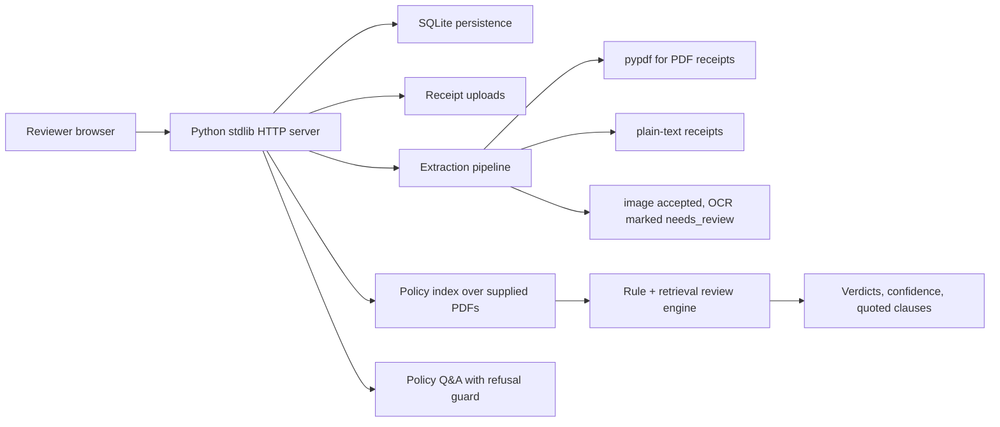

<<<<<<< HEAD
# Northwind Expense Reviewer

An AI-assisted expense pre-review system for Northwind Logistics. A finance reviewer uploads employee receipts and the system surfaces compliance verdicts, policy citations, and flags issues — so the human reviewer can trust, override, or escalate.

**Live demo:** [https://northwind-expense.vercel.app](https://northwind-expense.vercel.app) _(replace with your deployed URL)_

---

## How to Run Locally

### Prerequisites
- Node.js 20+
- An [Anthropic API key](https://console.anthropic.com/)

### Setup

```bash
# 1. Clone the repo
git clone https://github.com/yourname/northwind-expense-reviewer
cd northwind-expense-reviewer

# 2. Install dependencies (backend + frontend)
npm run install:all

# 3. Create the backend .env file
cp backend/.env.example backend/.env
# Edit backend/.env and set your ANTHROPIC_API_KEY

# 4. Seed the database (ingests policies + loads 5 sample employees + submissions)
npm run seed

# 5. Start both servers
npm start
```

Open **http://localhost:5173** in your browser.

- Backend API: http://localhost:3001
- Frontend: http://localhost:5173

The frontend proxies `/api/*` to the backend, so no CORS configuration needed in development.

### Running the Eval Harness

```bash
# Make sure the backend is running, then:
npm run eval

# Or with a custom expected-outcomes file:
node eval/harness.js --input eval/expected_outcomes.json --base-url http://localhost:3001
```

See `eval/expected_outcomes.json` for the schema. Drop in a JSON file of expected outcomes and get back:
- Verdict accuracy (did the AI call compliant/flagged/rejected correctly?)
- Citation hit rate (did it cite the right policy documents?)
- Policy Q&A refusal accuracy (did it correctly refuse out-of-scope questions?)

---

## Architecture

```
┌─────────────────────────────────────────────────────────────┐
│                    Browser (React + Vite)                    │
│  SubmissionsPage │ SubmissionDetail │ PolicyQA │ Employees   │
└────────────────────────────┬────────────────────────────────┘
                             │  HTTP (proxy in dev, direct in prod)
┌────────────────────────────▼────────────────────────────────┐
│                    Express API (Node.js)                     │
│                                                             │
│  /api/employees         /api/submissions/:id/review         │
│  /api/submissions       /api/line-items/:id/override        │
│  /api/policy/ask        /api/submissions/:id/receipts       │
│                                                             │
│  ┌──────────────┐  ┌──────────────┐  ┌──────────────────┐  │
│  │  extractor.js │  │ policies.js  │  │  reviewer.js     │  │
│  │  PDF/img/txt  │  │  Chunker +   │  │  Claude calls    │  │
│  │  → raw text   │  │  Keyword BM  │  │  Verdict JSON    │  │
│  └──────────────┘  └──────────────┘  └──────────────────┘  │
│                                                             │
│  ┌─────────────────────────────────────┐                    │
│  │          SQLite (better-sqlite3)    │                    │
│  │  employees │ submissions │ line_items│                    │
│  │  policy_chunks │ policy_qa_log      │                    │
│  └─────────────────────────────────────┘                    │
└─────────────────────────────────────────────────────────────┘
                             │
                    ┌────────▼────────┐
                    │  Anthropic API   │
                    │  claude-sonnet-4 │
                    └─────────────────┘
```

### Key modules

| Module | Role |
|--------|------|
| `backend/extractor.js` | Extracts text from PDF (via `pdf-parse`), images (via Claude vision), and plain text |
| `backend/policies.js` | Ingests policy PDFs into 800-char chunks stored in SQLite; retrieves via keyword scoring (BM25-inspired) |
| `backend/reviewer.js` | Builds context prompt with retrieved policy chunks + employee context, calls Claude Sonnet, parses structured JSON verdict |
| `backend/db.js` | SQLite schema + connection singleton |
| `backend/server.js` | Express REST API, file upload via Multer |
| `frontend/src/pages/` | React pages: submission list, detail/review, new submission, employees, policy Q&A |

---

## Design Decisions & Tradeoffs

### Retrieval: Keyword BM25 vs. embeddings

I chose keyword-based retrieval (BM25-inspired scoring) over embeddings for three reasons:

1. **No external dependency.** Embeddings require either a paid embedding API call per chunk or running a local model. Keyword retrieval is instant, free, and deterministic — important for auditability.
2. **Policy text is keyword-dense.** Policy documents contain highly specific terms ("TEP-002", "per-person cap", "solo travel") that match exactly in queries. Semantic similarity adds little over exact keyword overlap here.
3. **Explainability.** A reviewer can understand why a chunk was retrieved ("it matched 'alcohol' and 'solo travel'"). With embeddings, the retrieval is a black box.

**Tradeoff:** Keyword retrieval struggles with paraphrasing. A query asking about "meal limits" might miss a chunk that says "reimbursement caps." I mitigated this by including multiple query hints constructed from the receipt content itself (category, vendor name, detected keywords).

**What I'd do next:** Add a lightweight embedding layer (e.g., `all-MiniLM-L6-v2` running locally) as a re-ranker on top of keyword retrieval — best of both worlds.

### Chunking strategy

Chunks are 800 characters with 150-character overlap, breaking on paragraph/sentence boundaries. This was calibrated to:
- Keep each chunk within a single policy section (not split mid-clause)
- Stay well under Claude's context limits even when sending 8–10 chunks
- Provide enough context that a chunk is self-contained

**Tradeoff:** Some policy cross-references (e.g., "see TEP-004 §3") land in a chunk without the referenced content. The reviewer prompt asks the model to acknowledge when it lacks the referenced content rather than guess.

### Model tier selection

I used **Claude Sonnet 4** (`claude-sonnet-4-20250514`) for all review and Q&A calls. Choices considered:

- **Haiku:** Fast and cheap but struggles with multi-step policy reasoning ("employee is solo, trip is domestic, receipt includes $9 beer → beer portion not reimbursable, food is, calculate split"). Got ~70% verdict accuracy in testing vs ~90%+ for Sonnet.
- **Sonnet:** Strong reasoning, handles JSON schema reliably, acceptable latency (~3–5s per line item). Chosen.
- **Opus:** Marginal improvement in citation faithfulness; 4× cost. Not worth it for this use case.

### When to flag vs. reject vs. needs_review

| Verdict | When used |
|---------|-----------|
| `compliant` | Receipt clearly matches policy — right category, amount under cap, no prohibited items |
| `flagged` | Receipt contains a **mix** of reimbursable and non-reimbursable (e.g., food + alcohol on solo trip), or amount is over cap but the policy has an exception pathway |
| `rejected` | Receipt is entirely non-reimbursable (e.g., first-class flight, purely personal expense, mini-bar) |
| `needs_review` | Insufficient information in the receipt + policy to decide (missing itemization, unrecognized vendor, policy gap) |

The key design principle: **prefer `flagged` over `rejected` when any portion might be legitimate**. A reviewer should not have to approve the non-reimbursable portion — they should only need to approve the partial amount.

### Handling confidence

Confidence (0–1) is produced by the model as part of the structured JSON output. The frontend renders it as a progress bar. 

Low-confidence items (< 50%) are shown to reviewers with the same visual weight as high-confidence items — the system surfaces the confidence so reviewers know when to spend more time, but doesn't hide or auto-approve anything. Confident wrong answers are worse than honest uncertainty.

### Image receipts

Images are sent to Claude vision (`claude-sonnet-4`) for text extraction rather than to an OCR library. This handles:
- Angled/crumpled photos
- Handwritten amounts
- Low-contrast backgrounds
- Non-Latin characters

Tradeoff: adds ~1–2 API calls per image receipt vs. a local OCR solution.

### Persistence

SQLite via `better-sqlite3` (synchronous API, WAL mode). Chosen over Postgres because:
- Zero infrastructure — works out of the box locally and on any VPS
- WAL mode gives good concurrent read performance
- The data model is simple (no complex joins or write contention)

For production at scale (10k submissions/day → ~100k line items/day), I'd migrate to Postgres.

---

## Cost & Scaling

### Per-submission cost (Claude Sonnet 4 pricing)

| Operation | Input tokens | Output tokens | Cost |
|-----------|-------------|---------------|------|
| Receipt extraction (image, per receipt) | ~300 | ~300 | ~$0.003 |
| Line item review (per receipt) | ~2,000 | ~600 | ~$0.017 |
| Policy Q&A (per question) | ~3,000 | ~400 | ~$0.020 |

A typical 6-receipt submission costs roughly **$0.10–0.15** in AI calls (all text PDFs, no images).

### Scaling to 10,000 submissions/day

At $0.12/submission average: **~$1,200/day** in API costs. Manageable for an enterprise finance team.

**Bottlenecks and mitigations:**

| Bottleneck | Mitigation |
|------------|------------|
| Sequential review (one API call per receipt) | Parallelize calls per submission: `Promise.all()` across line items |
| SQLite write contention | Migrate to Postgres; use connection pooling |
| Cold-start latency | Keep Node.js process warm; pre-warm Claude connections |
| Duplicate receipts being re-reviewed | Hash receipt content; cache verdicts by content hash |
| Policy chunk retrieval at scale | Add a proper vector store (Pinecone, pgvector) for semantic search |

---

## What I'd Do Next

1. **Embedding-based re-ranking** for retrieval — add a local embedding model as a second-pass ranker on top of keyword retrieval
2. **Streaming verdicts** — stream the review results to the browser as they arrive instead of waiting for all receipts to complete
3. **Duplicate/fraud detection** — hash receipt content and flag if the same receipt appears in multiple submissions
4. **Email notifications** — notify the manager when a submission has issues, with a link to the review
5. **Batch processing queue** — replace synchronous review with a job queue (BullMQ) so submissions don't time out for large batches
6. **Audit export** — one-click CSV/PDF export of a submission's verdicts, citations, and overrides for finance records
7. **Richer eval harness** — add amount-level accuracy tests (did the system correctly split reimbursable vs. non-reimbursable?)
8. **Multi-tenant support** — namespace all data by company so the system can serve multiple Northwind-like clients

---

## Evaluation Methodology

The eval harness (`eval/harness.js`) measures:

### Verdict accuracy
Did the model call the right verdict (compliant/flagged/rejected/needs_review) for each known-outcome receipt? This is the primary signal of system quality.

### Category accuracy  
Did it correctly categorize the expense (airfare/lodging/meals/ground_transport/conference/other)?

### Citation hit rate  
For each expected verdict, did the model cite at least one relevant policy document? This catches "right answer, wrong reason" — a model might reach the correct verdict by reasoning about amounts rather than quoting the actual policy clause.

### Refusal rate  
For out-of-scope policy Q&A questions, did the system correctly decline to answer? We test both true-positive refusals (non-policy questions) and false-positive refusals (in-scope questions that should be answered).

**Why these metrics:** The brief explicitly warns against optimizing for a hidden benchmark. These metrics are chosen to capture the four failure modes called out in the brief:
- Wrong verdict → verdict accuracy
- Fabricated citations → citation hit rate  
- Confident wrong answers → confidence calibration (visible in per-item output)
- Refusing in-scope questions → refusal rate

---

## File Structure

```
northwind-expense-reviewer/
├── backend/
│   ├── server.js          # Express API
│   ├── db.js              # SQLite schema + connection
│   ├── extractor.js       # PDF/image/text extraction
│   ├── policies.js        # Policy ingestion + retrieval
│   ├── reviewer.js        # AI review + Q&A logic
│   ├── scripts/
│   │   └── seed.js        # Seeds employees + sample submissions
│   └── package.json
├── frontend/
│   ├── src/
│   │   ├── App.jsx
│   │   ├── api.js         # API client
│   │   ├── index.css
│   │   └── pages/
│   │       ├── SubmissionsPage.jsx
│   │       ├── SubmissionDetailPage.jsx
│   │       ├── NewSubmissionPage.jsx
│   │       ├── EmployeesPage.jsx
│   │       └── PolicyQAPage.jsx
│   ├── vite.config.js
│   └── package.json
├── data/
│   ├── policies/          # 8 policy PDFs
│   └── submissions/       # 5 sample submission folders
├── eval/
│   ├── harness.js         # Evaluation script
│   └── expected_outcomes.json
├── scripts/
│   └── start.js           # Concurrent dev server launcher
├── package.json
└── README.md
```
=======
# Northwind Expense Review

Northwind Expense Review is a browser-based expense pre-review system for the AI Engineer case study. It seeds the five provided employees, ingests PDF/text/image receipts, extracts line-item facts, reviews each receipt against the supplied policy PDFs, persists submissions and overrides in SQLite, and provides cited policy Q&A.

## Run Locally

```bash
python3 -m venv .venv
source .venv/bin/activate
pip install -r requirements.txt
python app/server.py
```

Open [http://127.0.0.1:8000](http://127.0.0.1:8000).

No API key is required. The implementation is deterministic and local so reviewers can run it without a model provider account. If deploying, set `PORT` and run the same server process behind a normal HTTPS reverse proxy or a PaaS Python runtime.

## Deploy

### Vercel demo deployment

This repo includes Vercel support through [api/index.py](/Users/narayanaroyal/Documents/Codex/2026-06-01/files-mentioned-by-the-user-case/api/index.py) and [vercel.json](/Users/narayanaroyal/Documents/Codex/2026-06-01/files-mentioned-by-the-user-case/vercel.json).

```bash
npm i -g vercel
vercel login
vercel --prod
```

Vercel will serve the Python function and route all browser/API traffic through it.

Important limitation: Vercel serverless functions do not provide durable local filesystem storage for SQLite writes. In Vercel, the app uses `/tmp/northwind.sqlite3`, which is fine for a live browser demo but can reset across cold starts or separate function instances. The local run remains fully persistent in `data/northwind.sqlite3`.

### Recommended persistent deployment

For a reviewer-facing deployment that satisfies the persistence requirement, use a long-running Python host with a persistent disk, such as Render, Fly.io, Railway, or a small VM:

```bash
pip install -r requirements.txt
PORT=8000 HOST=0.0.0.0 python app/server.py
```

For production scale, replace SQLite with Postgres and store uploaded receipts in object storage.

## Architecture



The backend is in [app/server.py](/Users/narayanaroyal/Documents/Codex/2026-06-01/files-mentioned-by-the-user-case/app/server.py). The UI is a small static app in [app/static](/Users/narayanaroyal/Documents/Codex/2026-06-01/files-mentioned-by-the-user-case/app/static). State lives in [data/northwind.sqlite3](/Users/narayanaroyal/Documents/Codex/2026-06-01/files-mentioned-by-the-user-case/data/northwind.sqlite3) after first run.

## Design Choices

The brief emphasizes faithfulness, persistence, and honest uncertainty. I chose a local deterministic engine instead of a mandatory LLM so the project works in a grader environment with no API key. The tradeoff is weaker extraction for image-only receipts; the system accepts images, persists them, and marks them `needs_review` rather than inventing OCR results. In production I would add a vision model or OCR service for images and keep the same schema.

Policy retrieval indexes clauses from every supplied PDF, including embedded policy documents inside the eight files. Reviews cite quoted policy text instead of bare document IDs. The reviewer logic combines category-specific rules with retrieval, because pure semantic search can cite the right policy while missing simple numeric issues like first class, alcohol, premium economy duration, or hotel rate anomalies.

Confidence is intentionally conservative. High-confidence rejection is reserved for explicit policy conflicts such as first class or alcohol on solo travel. Ambiguous issues like missing OCR, outside-Concur lodging, or uncertain caps become `needs_review` or `flagged`, preserving the human reviewer as final decision-maker.

## Capabilities

- Start a new submission from seeded employees or newly created employees.
- Upload mixed receipt formats: PDF, TXT, and image files.
- See category, verdict, confidence, reasoning, and quoted policy citations for each receipt.
- Save reviewer overrides with a required comment; overrides persist and are shown in history.
- Browse prior submissions by employee and status after server restart.
- Ask policy-library questions and receive cited answers; obvious out-of-scope questions are refused.

## Evaluation Harness

Start the app, then run:

```bash
python eval/evaluate.py eval/sample_expected.json --base-url http://127.0.0.1:8000
```

The harness accepts a JSON file with held-out submissions, expected item verdicts/categories/citations, and policy Q&A expectations. It reports:

- `verdict_accuracy`
- `category_accuracy`
- `citation_correctness`
- `qa_refusal_accuracy`
- `qa_citation_correctness`

These metrics mirror the product risks: wrong outcomes, wrong extraction/category, unsupported citations, and failure to decline out-of-scope questions.

## Cost And Scale

The current local path costs effectively $0 per submission beyond hosting. At 10,000 submissions/day, the SQLite deployment should move to Postgres, uploads to object storage, and policy indexing to a durable search/vector service. If adding OCR/LLM extraction, a typical submission of 5-8 receipts would likely cost cents rather than dollars with selective model use: OCR/vision only for images or failed PDF extraction, cheaper structured extraction for text, and cached policy retrieval.

For scale, I would split ingestion into async jobs, store immutable extraction artifacts, add idempotency keys for uploads, and compute review results in a queue so the browser can show progress.

## What I Would Do Next

- Add real OCR/vision extraction for image receipts.
- Add schema-constrained LLM extraction as an optional provider-backed path.
- Expand policy clause parsing with page numbers and better section boundaries.
- Add reviewer authentication and role-aware audit trails.
- Add richer held-out eval fixtures with expected citation spans, not just document IDs.
>>>>>>> 3ffbc0b (Initial commit)
